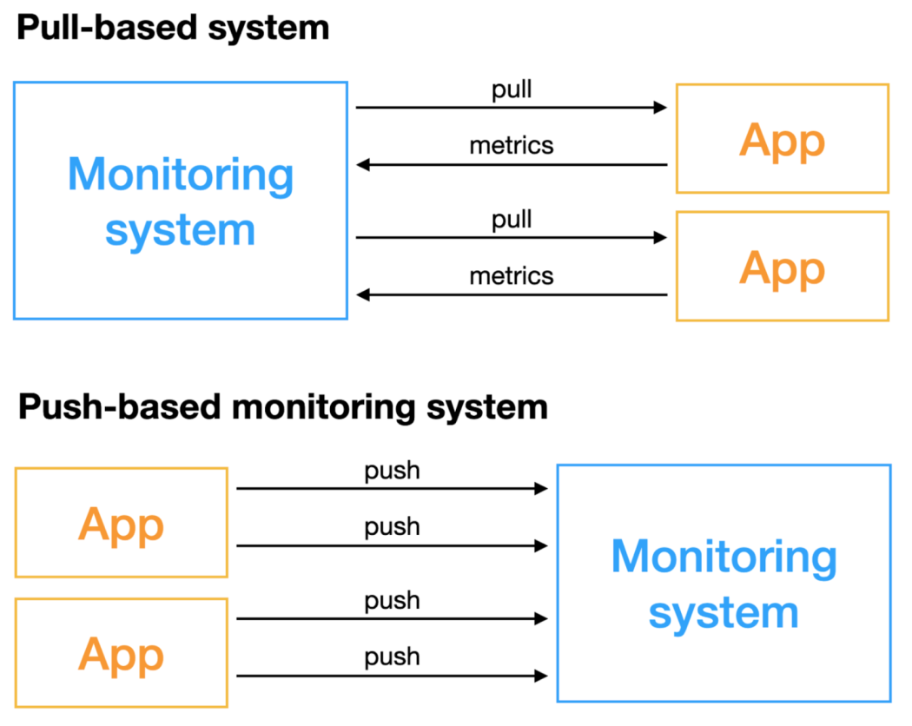
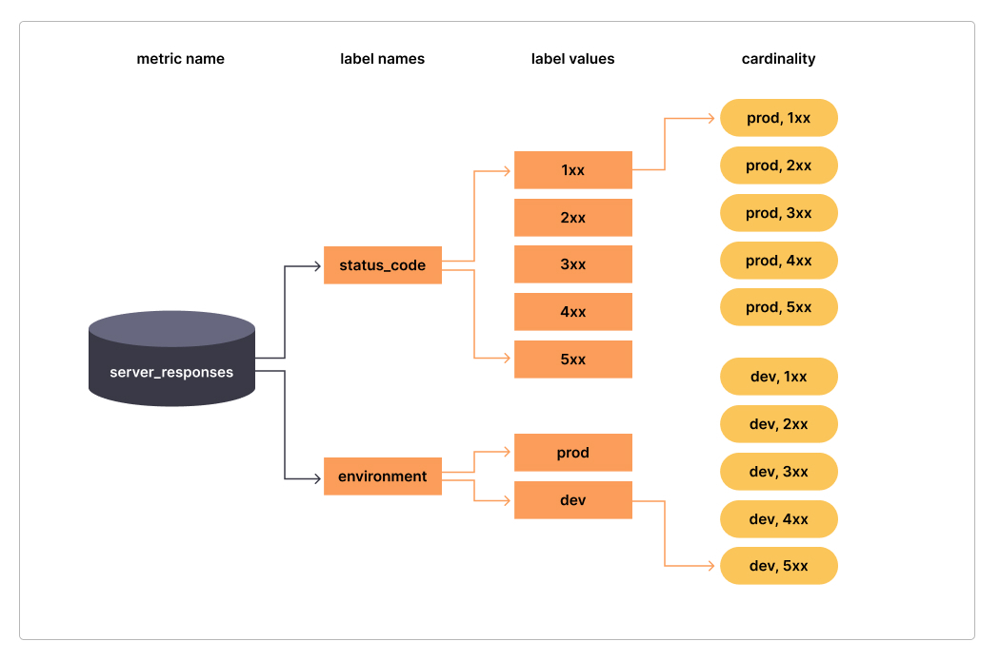

## metric && time series 

In layperson terms, metrics are numeric measurements. Time series means that changes are recorded over time. What users want to measure differs from application to application. For a web server it might be request times, for a database it might be number of active connections or number of active queries etc.

## pull model vs push model 
There are two different methods when thinking about how metrics are ingested into a monitoring system: either the metrics get pushed (usually via UDP) into the system or they get pulled (usually via HTTP).

### pull based

The Pull-based monitoring system, as the name implies, is a monitoring system that actively obtains indicators, and the objects that require monitoring need to have the capability to be accessed remotely.

advantages of pull based model:

- easy to use
- service discovery
- centrilized configuration
- easy to encrypt traffic
- tcp pull based make sure that you have a minimum data loss

### push based

Push-based monitoring systems do not actively obtain data, but the monitored objects actively push indicators.

advantages of push based model:
- for a complex networking environement, this strategy is the best suited . (no need to open ports to pull metrics)
- less cost than pull 
- easier to manage when you have multiple ingesters 
## multi demensional metric
as systems have become more and more complex, the concept of dimensional metrics, that is, metrics that also include a set of tags or labels (i.e., the dimensions) to provide additional context, emerged. Monitoring systems that support dimensional metrics allow engineers to easily aggregate and analyze a metric across multiple components and dimensions by querying for a specific metric name and filtering and grouping by label.

-> https://www.timescale.com/blog/four-types-prometheus-metrics-to-collect/

## Metric cardinality

Metric cardinality is another important concept, and refers to the number of unique combinations of labels that can be generated from a particular metric.

if you have a metric `server_responses` that will have two labels:

- env with cardinality of 2 (two possible values)
- satuts_code with cardinality of 5

the metric cardinality will be: 5x2 = 10

> you always make sure that your cardinality is not too high to avoid performance issues (the maximum recomanded cardinality is 100 000 )

-> https://promcon.io/2019-munich/slides/containing-your-cardinality.pdf
->https://grafana.com/blog/2022/02/15/what-are-cardinality-spikes-and-why-do-they-matter/#:~:text=Cardinality%20spike%3A%20Basic%20diagram%20of,the%20metric%20server_responses%20is%2010.

## traces and spans?

A trace is a collection of operations that represents a unique transaction handled by an application and its constituent services. A span represents a single operation within a trace. Each span stores the start time, duration, and parent_id. Spans without a parent_id are rendered as root spans.

A distributed trace connects calling relationships among events in distributed services. For example, Service A calls Service B, which makes a database query and then hits a third-party API.

## events && logs

- Logs are human-readable flat text files that are used by developers to capture useful data. Logs messages occur at a single point in time (though not necessarily at every point in time).
- Events are structured logs. They follow a standardized format (JSON), 

### 
-> https://www.alibabacloud.com/blog/pull-or-push-how-to-select-monitoring-systems_599007
-> https://giedrius.blog/2019/05/11/push-vs-pull-in-monitoring-systems/
