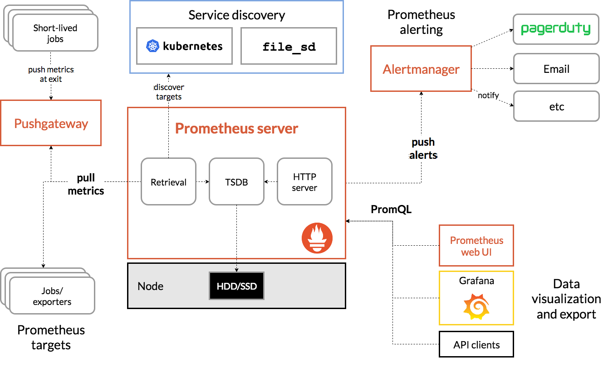
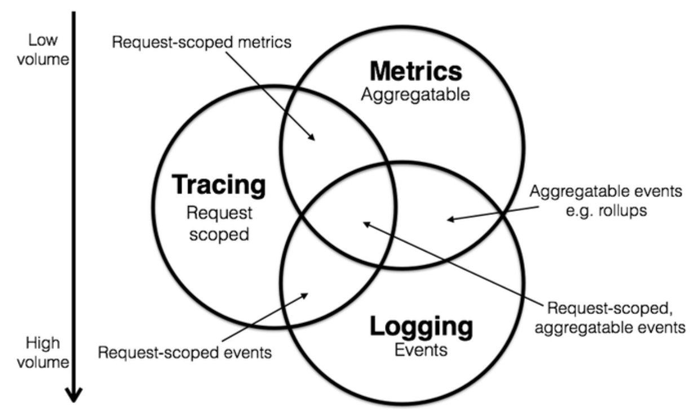

# prometheus

Prometheus is a monitoring and alerting system with a text based metric format, a multidimensional data model and a powerful query language.

Prometheus Querying Language (PromQL) is the main way to query metrics within Prometheus. You can display an expression’s return either as a graph or export it using the HTTP API.

## prometheus features

Prometheus's main features are:

- a multi-dimensional data model with **time series** data identified by metric name and key/value pairs
- PromQL, a flexible query language to leverage this dimensionality
- no reliance on distributed storage; single server nodes are autonomous
- time series collection happens via a **pull model** over HTTP
- pushing time series is supported via an intermediary gateway (pushgateway component)
- targets are discovered via service discovery or static configuration
- multiple modes of graphing and dashboarding support

## data model

Prometheus fundamentally stores all data as time series: streams of timestamped values belonging to the same metric and the same set of labeled dimensions. Besides stored time series, Prometheus may generate temporary derived time series as the result of queries.

Every metric has a unique identifier that can have labels with their respective values and an associated timestamp (with millisecond precision)

metric name may contain ASCII letters and digits, as well as underscores and colons. It must match the regex [a-zA-Z_:][a-zA-Z0-9_:]*.

### samples

Samples form the actual time series data. Each sample consists of:

- a float64 value
- a millisecond-precision timestamp

### Querying metrics

The syntax to query for data is as follows:

 ```promql
<metric_name>{<label_name>=<label_value>, ...}
```

This query will return all time-series of the metric metric_name matching the labels in the condition.
> This is the same notation that OpenTSDB uses.

## metric

there is mainly 4 different metric type in prometheus

### Counter

A _counter_ is a cumulative metric that represents a single [monotonically
increasing counter](https://en.wikipedia.org/wiki/Monotonic_function) **whose value can only increase or be reset to zero on restart** For example, you can
use a counter to represent the number of requests served, tasks completed, or
errors.

> Do not use a counter to expose a value that can decrease. For example, do not
use a counter for the number of currently running processes; instead use a gauge.

### Gauge

A _gauge_ is a metric that represents a single numerical value that**can arbitrarily go up and down.**

Gauges are typically used for measured values like temperatures or current
memory usage, but also "counts" that can go up and down, like the number of
concurrent requests.

### Histogram 

A _histogram_ samples observations (usually things like request durations or response sizes) and counts them in configurable buckets. It also provides a sum of all observed values.
the histogram metric will allow you to track the distribution of the size of events, allowing you to calculate quantiles from them.
A histogram with a base metric name of `<basename>` exposes multiple time series
during a scrape:

- cumulative counters for the observation buckets, exposed as `<basename>_bucket{le="<upper inclusive bound>"}`
- the **total sum** of all observed values, exposed as `<basename>_sum`
- the **count** of events that have been observed, exposed as `<basename>_count` (identical to `<basename>_bucket{le="+Inf"}` above)

Use the
[`histogram_quantile()` function](/docs/prometheus/latest/querying/functions/#histogram_quantile)
to calculate quantiles from histograms or even aggregations of histograms. When operating on buckets,
remember that the histogram is
[cumulative](https://en.wikipedia.org/wiki/Histogram#Cumulative_histogram).
Prometheus stores histograms internally in buckets that have a max size (labeled le), but no minimum size. You must configure the number and max size of each bucket ahead of time. Each bucket time series will contain the count of observations that was **less than or equal to its le value for a given timestamp.**

### Summary

Similar to a _histogram_, a _summary_ samples observations (usually things like
request durations and response sizes). While it also provides a total count of
observations _count and a sum of all observed values_sum, it calculates configurable
quantiles over a sliding time window.

A summary with a base metric name of `<basename>` exposes multiple time series
during a scrape:

- streaming **φ-quantiles** (0 ≤ φ ≤ 1) of observed events, exposed as `<basename>{quantile="<φ>"}`
- the **total sum** of all observed values, exposed as `<basename>_sum`
- the **count** of events that have been observed, exposed as `<basename>_count`

> The essential difference between summaries and histograms is that summaries calculate streaming φ-quantiles on the client side and expose them directly, while histograms expose bucketed observation counts and the calculation of quantiles from the buckets of a histogram happens on the server side using the histogram_quantile() function.

## labels

labels are key value pairs associated with time series that in addition to the metric name , uniquely identify them .

there is two types of labels :

- Instrumentation labels: as the name indicates, come from your instrumentation . they are labels know internally by your application or library such as the type of http request that you received, which database is talking to, which method is called ...
- Target labels: identifies the environment that your application leaves in: which region , which datacenter, which team own it ...

> target labels comes from service discovery.

Label names may contain ASCII letters, numbers, as well as underscores. They must match the regex [a-zA-Z_][a-zA-Z0-9_]*.
> Label names beginning with __ are reserved for internal use.
> A label with an empty label value is considered equivalent to a label that does not exist.
> the label names used for a metric should not change during the lifetime of an application process. if you feel the need for this you probably want a log based monitoring solution for that use case.

## label patterns

label values can only be string . in this section we will work you through the different patterns that we can use in labeling

### enum

For same cases your resources needs to be exactly on one of the states of "starting", "running", "stopping" or "terminating".

We cloud expose a gauge that will correspond a number to the state : for example 0 is equivalent to "starting" . in this solution, it's difficult to manage it with promQL .

the best solution would be to add a label for the state to the gauge .

for example:

```promql
resource_state{resource_state="RUNNING", app_name="nginx"} 0
resource_state{resource_state="STARTING", app_name="nginx"} 1
resource_state{resource_state="STOPPING", app_name="nginx"} 0
```

> you need to be aware of the cardinality when using this pattern. you may have performance issue due to the volume of samples and times series that may result

### info

info metrics also known as machine roles are useful for annotations such as build information, version number ...

The convention that has emerged is to use a gauge with the value 1 and all the annotations needed expressed as labels .

For instance:

```promql
resource_info{build_version="1.253",version="5.3.2" } 1.0
```

## Exposition format

Metrics can be exposed to Prometheus using a simple text-based exposition format.

> Some earlier versions of Prometheus supported an exposition format based on Protocol Buffers (aka Protobuf) in addition to the current text-based format. As of version 2.0, however, Prometheus no longer supports the Protobuf-based format

### Basic info

| Aspect | Description |
|--------|-------------|
| **Supported in** |  Prometheus version `>=0.4.0` |
| **Transmission** | HTTP |
| **Encoding** | UTF-8, `\n` line endings |
| **HTTP `Content-Type`** | `text/plain; version=0.0.4` (A missing `version` value will lead to a fall-back to the most recent text format version.) |
| **Optional HTTP `Content-Encoding`** | `gzip` |
| **Advantages** | <ul><li>Human-readable</li><li>Easy to assemble, especially for minimalistic cases (no nesting required)</li><li>Readable line by line (with the exception of type hints and docstrings)</li></ul> |
| **Limitations** | <ul><li>Verbose</li><li>Types and docstrings not integral part of the syntax, meaning little-to-nonexistent metric contract validation</li><li>Parsing cost</li></ul>|
| **Supported metric primitives** | <ul><li>Counter</li><li>Gauge</li><li>Histogram</li><li>Summary</li><li>Untyped</li></ul> |

### Text format details

Prometheus' text-based format is line oriented. Lines are separated by a line feed character (\n). The last line must end with a line feed character. Empty lines are ignored.

> escape is done by a backslash. for example \\ and \\n

```promql
metric_name [
  "{" label_name "=" `"` label_value `"` { "," label_name "=" `"` label_value `"` } [ "," ] "}"
] value [ timestamp ]
```

In the sample syntax:

- `metric_name` and `label_name` carry the usual Prometheus expression language restrictions.
- `label_value` can be any sequence of UTF-8 characters, but the backslash (`\`), double-quote (`"`), and line feed (`\n`) characters have to be escaped as `\\`, `\"`, and `\n`, respectively.
- `value` is a float represented as required by Go's [`ParseFloat()`](https://golang.org/pkg/strconv/#ParseFloat) function. In addition to standard numerical values, `NaN`, `+Inf`, and `-Inf` are valid values representing not a number, positive infinity, and negative infinity, respectively.
- The `timestamp` is an `int64` (milliseconds since epoch, i.e. 1970-01-01 00:00:00 UTC, excluding leap seconds), represented as required by Go's [`ParseInt()`](https://golang.org/pkg/strconv/#ParseInt) function.

### Comments, help text, and type information

it is recommanded to use HELP and TYPE comment when exposing metrics.

- HELP is a description of what metric is .
- TYPE is one of COUNTER, GAUGE, SUMMARY, HISTOGRAM or untyped (untyped is the default when TYPE is not defined)

> Only one TYPE line may exist for a given metric name. The TYPE line for a metric name must appear before the first sample is reported for that metric name.
> when using a baskslash on HELP you need to escape it .

### text format example

```promql
# HELP http_requests_total The total number of HTTP requests.
# TYPE http_requests_total counter
http_requests_total{method="post",code="200"} 1027 1395066363000
http_requests_total{method="post",code="400"}    3 1395066363000

# Escaping in label values:
msdos_file_access_time_seconds{path="C:\\DIR\\FILE.TXT",error="Cannot find file:\n\"FILE.TXT\""} 1.458255915e9

# Minimalistic line:
metric_without_timestamp_and_labels 12.47

# A weird metric from before the epoch:
something_weird{problem="division by zero"} +Inf -3982045

# A histogram, which has a pretty complex representation in the text format:
# HELP http_request_duration_seconds A histogram of the request duration.
# TYPE http_request_duration_seconds histogram
http_request_duration_seconds_bucket{le="0.05"} 24054
http_request_duration_seconds_bucket{le="0.1"} 33444
http_request_duration_seconds_bucket{le="0.2"} 100392
http_request_duration_seconds_bucket{le="0.5"} 129389
http_request_duration_seconds_bucket{le="1"} 133988
http_request_duration_seconds_bucket{le="+Inf"} 144320
http_request_duration_seconds_sum 53423
http_request_duration_seconds_count 144320

# Finally a summary, which has a complex representation, too:
# HELP rpc_duration_seconds A summary of the RPC duration in seconds.
# TYPE rpc_duration_seconds summary
rpc_duration_seconds{quantile="0.01"} 3102
rpc_duration_seconds{quantile="0.05"} 3272
rpc_duration_seconds{quantile="0.5"} 4773
rpc_duration_seconds{quantile="0.9"} 9001
rpc_duration_seconds{quantile="0.99"} 76656
rpc_duration_seconds_sum 1.7560473e+07
rpc_duration_seconds_count 2693
```

for histograms:

- the _count metric must match the +inf metric.
- A histogram must have a bucket with {le="+Inf"}. Its value must be identical to the value of x_count.

> metric and labels names cannot start with a number and connot contain hyphens (-)


## prometheus architecture


Prometheus scrapes metrics from instrumented jobs, either directly or via an intermediary push gateway for short-lived jobs. It stores all scraped samples locally and runs rules over this data to either aggregate and record new time series from existing data or generate alerts. Grafana or other API consumers can be used to visualize the collected data.

> Each scrape only transfers the current value of every time series of a target to Prometheus, so the scrape interval determines the final sampling frequency of the stored data. The target processes do not retain any historical metrics data themselves.
The Prometheus ecosystem consists of multiple components, many of which are optional:

- the main Prometheus server which scrapes and stores time series data
- client libraries for instrumenting application code
- a push gateway for supporting short-lived jobs
- special-purpose exporters for services like HAProxy, StatsD, Graphite, etc.
- an alertmanager to handle alerts

## prometheus limitation

- no high availibility
- no long term storage
- no horizental scalibility
- prometheus is not suitable for storing event logs
- prometheus is not suitable for data with high cardinality like usernames && passwords
- prometheus preferred to have 99.9% of accuracy (due to bad scrapes, etc) which make him not suitable for billing like billing per request.

## exporters


A Prometheus Exporter is a piece of software that

- Can fetch statistics from another, non-Prometheus system
- Can turn those statistics into Prometheus metrics, using a client library
- Starts a web server that exposes a /metrics URL, and have that URL display the system metrics

recommendations when writing exporters:

- respect metric naming
- if you can determine metric type, put it as untyped
- expose raw metrics rather than calculate on the application side
- no caching
- create new metric is preferred
- Avoid type as a label name, it’s too generic and often meaningless. You should also try where possible to avoid names that are likely to clash with target labels, such as region, zone, cluster, availability_zone, az, datacenter, dc, owner, customer, stage, service, environment and env.

## structuring and naming metric


the overall structure of a metric name is generally:
```
 library_name_unit_suffix
```

- a metric must start with a letter and can be followed with any number of letters, numbers and underscores
  > `:` can be used in the metric name but by convention it's reserved to recording rules.
- by convention using snake case is recommanded. For example, if you have `my awesome metric` , you need to declare it as `my_awesome_metric`
- suffixes `_sum` `_count` `_total` are used by summary and historgrams metrics. it is recommanded to avoid them
- should have a suffix describing the unit, in **plural** form
- should have a (single-word) application prefix relevant to the domain the metric belongs to like `prometheus_http_request`
- should use base units (e.g. seconds, bytes, meters )

## observability

What is Observability?

In control theory, observability is a measure of how well internal states of a system can be inferred from knowledge of its external outputs. In general terms, a system is observable if you can check how well its functioning internally. This can be achieved by different means:
    - Metrics: the atomic pieces at a system that are measurable and aggregative.
    - Logging: details of individual events at the system.
    - Tracing: a higher level. Scope of requests/transactions and all the steps involved.


## references

- https://prometheus.io/docs/practices/naming/