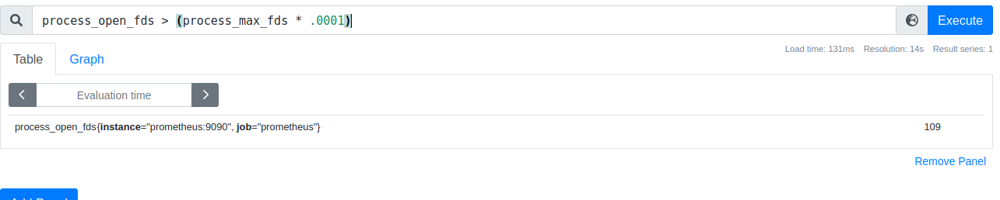

size of all filesystems mounted under /run but not /run/lock:


```promql
node_filesystem_files{job='node',mountpoint=~"/run.*",mountpoint!~"/run/lock"}
```


the average number of file descriptors across all your jobs :


```promql
avg without(instance,job) (process_open_fds)
```


- the amount of traffic received per second

```promql
rate(node_network_receive_bytes_total[5m])
```

- the total bytes received per machine

```promql
sum without(device) (rate(node_network_receive_bytes_total[5m]))
```


- explain request
  

  -> total per second prometheus http request rate.

- average request duration in the past 5 minutes

```promql
sum without(handler) (rate(prometheus_http_request_duration_seconds_sum[5m]))
/
sum without(handler) (rate(prometheus_http_request_duration_seconds_count[5m]))
```

- explain :


-> 0.9 quantiles latency of prometheus's compaction latency over the past day.

- count the number of CPUs per instance


```promql
count by(instance)(count without(mode) (node_cpu_seconds_total))
```


> for the inner count you can also use sum since we don't carry about the value

- get the number of processes for each job that have more than 10 open file descriptors


```promql
sum without(instance)(process_open_fds > bool 10)
```


the inner query will output 1 if the process have more than 10 fds or 0 if less. we will than just sum the processes with an aggregation on instance.

- explain


-> get all the instances that have there open file descriptors more the 0.0001 of the max file descriptors.

## notes

- when using counter, tou must use rate befor agregating
- when calculating average, it is important that you aggregate up the sum and count, and only on the last step perform a division otherwise you could end up averaging averages, which is not statistically valid.
- it's not possible to aggregate the quantiles of a summary
- quantile cannot be aggregated or have arithmetic performed
- always rate buckets exposed by histogram metric since histogram_quantile needs gauges to work
