# promql

This section will introduce promql, how it works and different possible queries

## introduction

Prometheus provides a functional query language called PromQL (Prometheus Query Language) that lets the user select and aggregate time series data in real time. The result of an expression can either be shown as a graph, viewed as tabular data in Prometheus's expression browser, or consumed by external systems via the HTTP API.

## PromQL is a nested functional language

Unlike SQL or some other query languages that tend to be more imperative `(SELECT * FROM ...)`, PromQL is a nested functional language. That means that you describe the data you are looking for as a nested set of expressions that each evaluate (without side effects) to an intermediary value. Each intermediary value is used as an argument or operand of the expressions surrounding it, while the outer-most expression of your query represents the final return value that you get to see in a table, graph, or similar use case.

here is an example
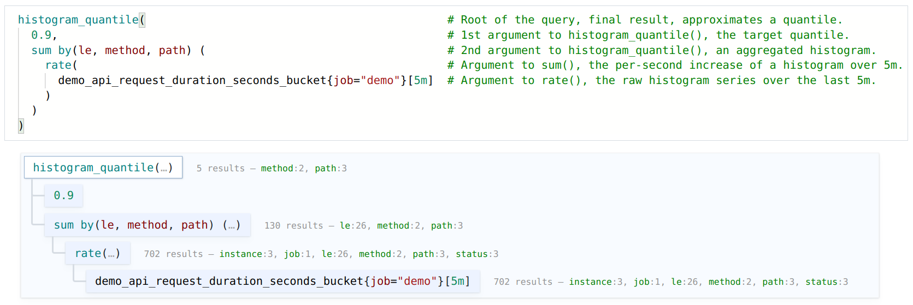

## Time Durations

Time durations are specified as a number, followed immediately by one of the following units:

```

- ms - milliseconds
- s - seconds
- m - minutes
- h - hours
- d - days - assuming a day has always 24h
- w - weeks - assuming a week has always 7d
- y - years - assuming a year has always 365d
```

Time durations can be combined, by concatenation. Units must be ordered from the longest to the shortest. A given unit must only appear once in a time duration.

Here are some examples of valid time durations:

```promql
5h
1h30m
5m
10s
```

> 1.5h is not a valid time duration

## matchers && selectors

working with all the different time series with different labels for a metric can be overwhelming and confusing when you have multiple targets to scrape.
you will always limit your query based on one instance or one particular label.Here came the concept of selectors where you can filter your time series baed on a particular value of label .
for example:
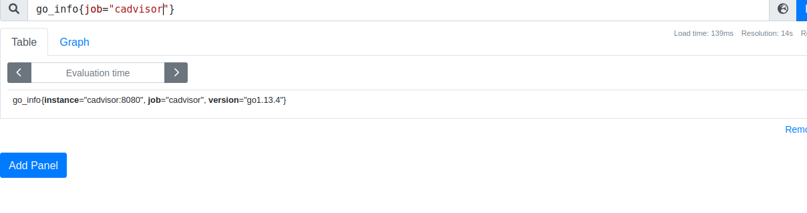

the selector will return all time series that have the label equals `job="cadvisor"` and metric name `go_info`.

the `job="cadvisor"` is called matchers and you can have many matchers in one selector.

We can distinguish 4 matchers:

- `=` the equality matcher: the label value of the time serie must match **exactly** the given label value. you can specify bar="" if you need to have the particular label not present.
- `!=` the negative equality: the label value of the time serie must NOT match the exact given label
- `=~` the regular expression matcher, the label value must match a regex expression. for example job~="demo.*" will much all labels that begins with demo.
  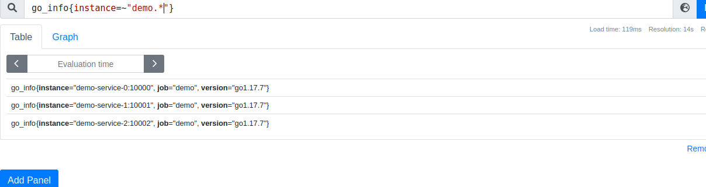
- `!~` the negative regular expression: will exclude label values based on regex

> you may reconsider your labels, if your using a lot of regex to extract the results. instead of doing a regex code="4.*" you may create a label with code="4xx" instead.

**notes:**

- you can use multiple matchers on the same label, -> promql-expressions.md
- the selector {} will return an error for safety measures (too expensive for the server)
- `{job=""}`,`{job!=""}` and `{job=~".*"}` will return errors. you need at least one matching label.
  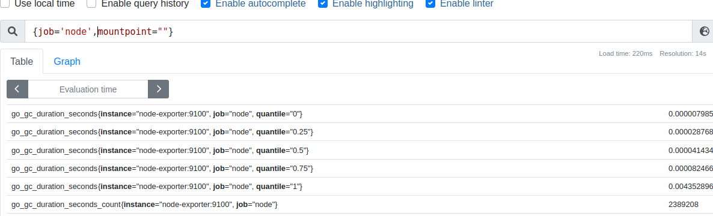
- Under the hood the metric name (api_http_requests_total) is stored as another label with the special (reserved) label name `__name__`. So the query `api_http_requests_total` would be 100% equivalent to the following query `{__name__="api_http_requests_total"}`
- if you want to return all time series you can use `{__name__=~".+"}`. Be careful with this query since it will overload your server

## Type of promql expression

In the previous lectures, we've learned about metric types (gauge, counter ...) this type is ignored by promQL. it uses mainly expression types instead: Each expression has a type and each function, operator, or other type of operation requires a specific type.

For example  `rate()`  function requires a range vector as an input and will output an instant vector.
The result of the rate() function will only be used in places that expects instant vectors.

Let's walk throw those types:

- `string`: simple string like 'hello world !' These only show up as arguments to certain functions (like label_join()) and are otherwise not used much in PromQL.
- `scalar`: simple number like `1` or `1.35`this type is used as a numeric parameters in functions such as `topk(3,0)` or arithmetic operations.  
    > 0 is a scalar with the value zero while {} 0 is an instant vector with the value zero
- `instant vector selector`:  A set of labeled time series, with one sample for each series, all at the same timestamp. Instant vectors can result either directly from a TSDB time series selector like `node_cpu_seconds_total`, or from any function or other transformation that returns them.

    ```promql
    node_cpu_seconds_total{cpu="0", mode="idle"}   → 19165078.75 @ timestamp_1
    node_cpu_seconds_total{cpu="0", mode="system"} →   381598.72 @ timestamp_1
    node_cpu_seconds_total{cpu="0", mode="user"}   → 23211630.97 @ timestamp_1
    ```

    > when you ask for the current cpu usage you don't want to have an instance that has been down a day ago or disappeared from the service discovery, a concept called staleness. in prometheus 1.0, this handled by returning time series no older than 5 minutes from the query evaluation time. In prometheus 2.0 they introduced the concept of stale marker (internal marker not accessible from API) that will be appended to the time series if the target is down. the instant vector are evaluated like the first approach (5 minutes samples) AND will be filtered if a stale marker is appended.

- `range vector selector`: (also known as matrix) A set of labeled time series, with a range of samples over time for each series. you can either produce them with the literal range selector `node_cpu_seconds_total[1m]` or by using a subquery (like `<expression>[5m:10s]`).
    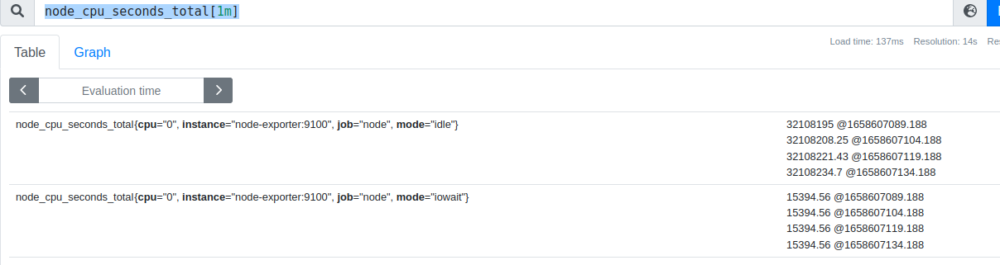
  range vectors are rarely used directly, it only comes up when to see raw materials or debug. we usually use them with the `rate(node_cpu_seconds_total[1m])` to to calculate the average per-second rate of increase over the last 1 minute. or `avg_over_time`
  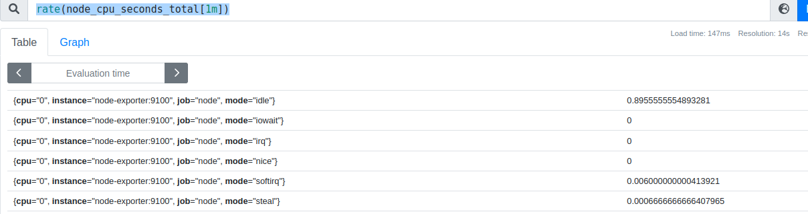

> don't under estimate metric type since they are also important ! For instance, the histogram_quantile() function only works on histogram metrics, rate() only works on counter metrics, and deriv() only works on gauges.since promql does not check the metric type, it will return a nonsense result if you use a rate with gauge for example.

## Offsets

offsets allows you to take the evaluation time for a query and put it back further in time (instead of the current time).the syntax of the offset will be `<vector selector> offset <duration>`

For example, you might want to compare the request rates of a week ago with the current request rates.

to query for the API request rate from a week ago:

```promql
rate(api_http_requests_total[5m] offset 1w)
```

You could then calculate the difference between the current request rate and the rate from last week:

```promql
rate(api_http_requests_total[5m] offset 1w) - rate(api_http_requests_total[5m])
```

Note: Offsets can only look back, not forward.

## Aggregation

There is 11 aggregation operators in all with 2 optional clauses (without and by) we will walk through one by one .
the inputs of aggregation are instant vectors and the output are instant vectors also.

the format of aggregation is :

```
<aggregation operator> by/without(<labels>) (<metric/subquery>)
```

For **grouping** we have two possibilities:

- `without`: specifies the labels to remove and aggregating based on the remaining labels .
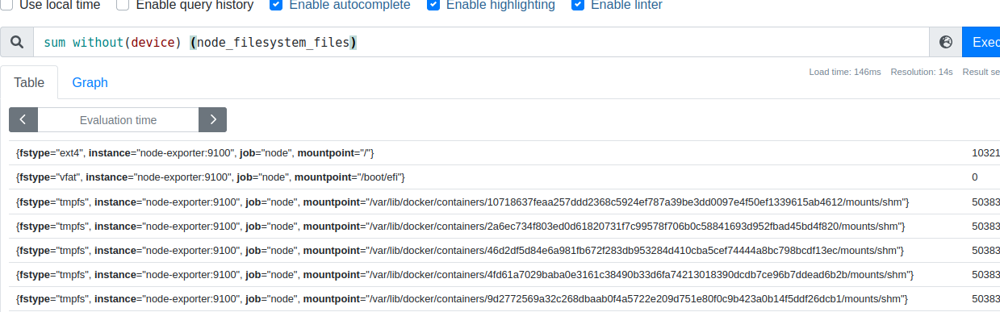

> `sum without() (node_filesystem_files)` is the same as `node_filesystem_files`

- `by`: inverse of without, by will specify the labels that you want to keep and make the aggregation
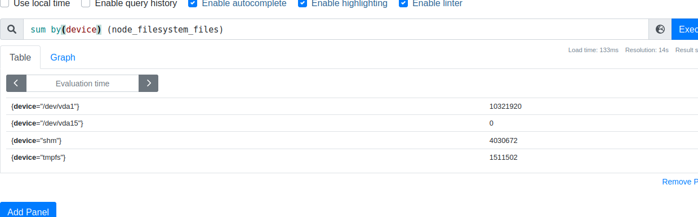

most of the case, we use without instead of by. but there is two cases that by is useful:

- unlike without, by does not drop automatically **name** label. this allows you to use it in manipulating name labels, like finding how many time series have the same metric name. `sort_desc(count by(__name__)({__name__=~".+"}))`
- for same cases, you need to preserve only one or two important labels and ignore the rest .

### aggregation operators

- `sum` (calculate sum over dimensions) adds up all the values in a group and returns as the value for the group.
  > when using counters, don't forget to use rate
  > don't use sum across different counters since it will be non sense (counters can be intialised in different times)
- `min` (select minimum over dimensions)
- `max` (select maximum over dimensions)
  > max && min will return `NaN` if all the time series are `NaN`
- `avg` (calculate the average over dimensions) returns the average of the values of the time series in the group as the value for the group.
  >avg without(cpu) (rate(node_cpu_seconds_total[5m])) is exactly the same as `sum without(cpu) (rate(node_cpu_seconds_total[5m])/count without(cpu) (rate(node_cpu_seconds_total[5m])`
- `count` (count number of elements in the vector) counts the number of time series in a group and returns the value for the group
  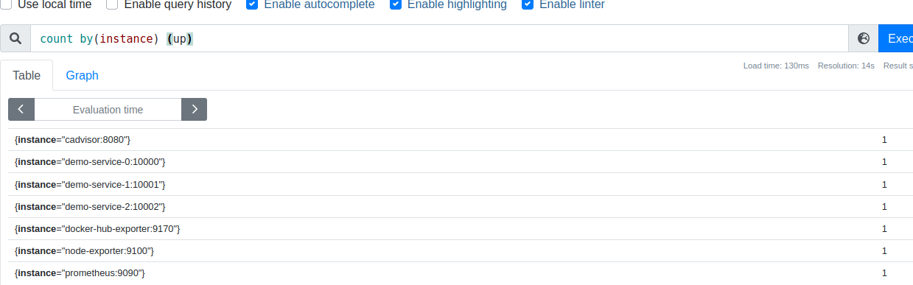
  > no need to use rate , in this case since we cares about the number of the time series that exists and not there values.

  > You can use count to investigate on the high cardinality of label. for instance `count (count by(cpu) (node_cpu_seconds_total))` will calculate the number of possible values of the cpu label
- `group` (all values in the resulting vector are 1)
- `stddev` (calculate population standard deviation over dimensions) the standard deviation in monitoring is to detect outliers
- `stdvar` (calculate population standard variance over dimensions)

- `count_values` (count number of elements with the same value)it is used to create frequency histogram
  for example to see how many of your machines had how many disks
  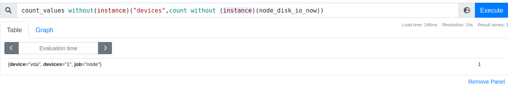
  `count_values without(instance)("devices",count without (instance)(node_disk_io_now))`
- `topk` (largest k elements by sample value) returns the k times series with the largest values.
  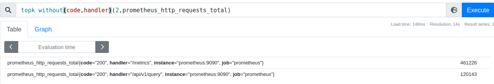
  > you can note that we have 2 time series (specified in the parameters) and that the result preserve the name of the metric and all the labels. the result is also sorted
- `bottomk` (smallest k elements by sample value) same as `topk` by returns k times series with smallest values instead.

- `quantile` (calculate φ-quantile (0 ≤ φ ≤ 1) over dimensions) returns the specified quantile of the values of the group as the group's return value. if you want for example, to calculate the `.95` quantile of the system mode cpu usage per cpu, you can use `quantile by (cpu) (0.95,rate(node_cpu_seconds_total{mode="system"}[5m]))`.
  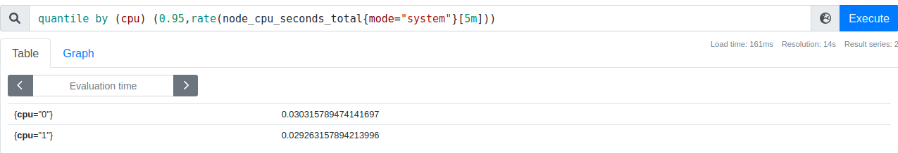
  that means that 95% of the time, my CPUs spends 0.03 seconds in the system mode
  >1st quartile is equivalent to 25 percentile with corresponds to 0.25 quantile
  
  > histogram_quantile works across buckets of one histogram metric child at a time in an instant vector.

# binary operators

## arithmetic operators

The following binary arithmetic operators exist in Prometheus:

- `+` (addition)
- `-` (subtraction)
- `*` (multiplication)
- `/` (division)
- `%` (modulo)
- `^` (power/exponentiation)

you can use those operators directly with the metrics:
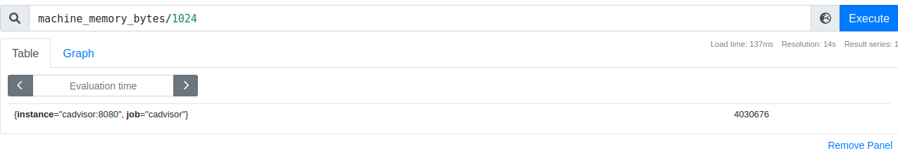

> even though using an arithmetic operator in a way that does not change the metric value, the metric name will be removed. for example some_gauge + 0 will not have a metric name.

## comparison operators

The following binary comparison operators exist in Prometheus:

- `==`(equal)
- `!=` (not-equal)
- `>` (greater-than)
- `<` (less-than)
- `>=` (greater-or-equal)
- `<=` (less-or-equal)

comparison operators are used mainly for filtering for example, we wan to have time series with mtu between 1490 and 1501.
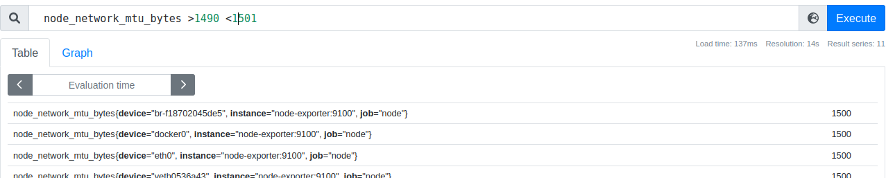

> we recommend avoiding == and != with a float value . you can instead the difference between the time serie value and the target value and compare it to epsilon( a very small number): `some_gauge - (target value) < 1e-6 > -1e-6`

> always make sure that the left hand side is the important value that you need

### bool modifier

Comparison operators are defined between scalar/scalar, vector/scalar, and vector/vector value pairs. By default they filter. Their behavior can be modified by providing bool after the operator, which will return 0(false) or 1(true) for the value rather than filtering.

- **Between two scalars**, the bool modifier must be provided fo example `43< bool 10`

- **Between an instant vector and a scalar**, If the bool modifier is provided, vector elements that would be dropped instead have the value 0 and vector elements that would be kept have the value 1. The metric name is dropped if the bool modifier is provided.

- **Between two instant vectors,** these operators behave as a filter by default, applied to matching entries. If the bool modifier is provided, vector elements that would have been dropped instead have the value 0 and vector elements that would be kept have the value 1, with the grouping labels again becoming the output label set. The metric name is dropped if the bool modifier is provided.

## vector matching

in this section we will see how we compare vectors between each others.

### one to one

In the default case, that is an operation following the format `vector1 <operator> vector2`. the two vectors must have the exact same set of labels and corresponding values in order to output a result.

for example:

```promql
coco{job="toto",instance="titi"} 4
kiki{job="toto",instance="titi"} 2

```

`coco / kiki` will result to `{job="toto",instance="titi"} 2`

> if an empty instant vector is returned instead of an expected instant vector, it is probably because one label on one vector did not match a label on the other vector.

<!-- ignoring clause-->
similar to grouping , you can have the ability to ignore a particular label when your matching two vector with `ignoring` clause .
for example:

```promql
coco{job="toto",instance="titi"} 4
kiki{job="toto"} 2

```

we need to query :

```promql
coco 
/ ignoring (instance) kiki
```

will have a result `{job="toto"} 2`.
<!-- on clause-->
Similarly to ignoring, we can instruct binary operator to take into consideration only one label .
for example:

```promql
coco{job="toto",instance="titi"} 4
kiki{job="toto"} 2
```

we need to query `coco / on (job) kiki` will have a result `{job="toto"} 2`.

### many to one

It's possible to use comparison and arithmetic operations where an element on one side can be matched with many elements on the other side. You must explicitly tell Prometheus what to do with the extra dimensions.

group_left lets you specify that there can be multiple matching samples in the group of the left hand operand .

for example:

```promql
coco{job="toto",instance="titi"} 4
coco{job="toto",instance="bibi"} 6
kiki{job="toto"} 2

```

we need to query :

```promql
coco 
/ ignoring (instance) group_left kiki
```

will have a result :

```promql
{job="toto",instance="titi"} 2
{job="toto",instance="bibi"} 3
```

`group_left` ensures that extra labels on the left hand will be copied to the right hand .

> as many to one relation, the right hand must get the same labels on the left hand for each sample.

> Similarely to `group_left`, there is also `group_right` that will copies the right handed labels into the left one

### many to many (logical operator)

These logical/set binary operators are only defined between instant vectors:

- and (intersection)
- or (union)
- unless (complement)

vector1 and vector2 results in a vector consisting of the elements of vector1 for which there are elements in vector2 with exactly matching label sets. Other elements are dropped. The metric name and values are carried over from the left-hand side vector.
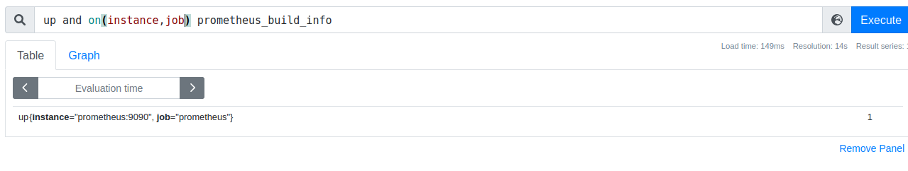
vector1 or vector2 results in a vector that contains all original elements (label sets + values) of vector1 and additionally all elements of vector2 which do not have matching label sets in vector1.
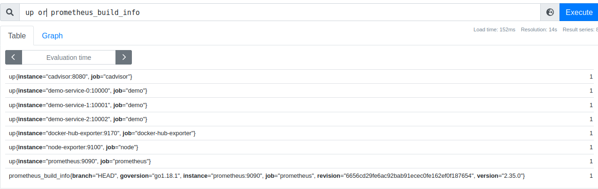
vector1 unless vector2 results in a vector consisting of the elements of vector1 for which there are no elements in vector2 with exactly matching label sets. All matching elements in both vectors are dropped.
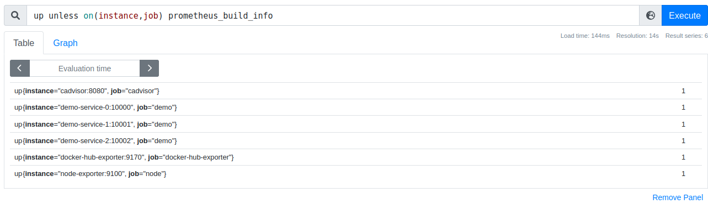

## Binary operator precedence

The following list shows the precedence of binary operators in Prometheus, from highest to lowest.

- ^
- *, /, %, atan2
- +, -
- ==, !=, <=, <, >=, >
- and, unless
- or

Operators on the same precedence level are left-associative. For example, 2 *3 % 2 is equivalent to (2* 3) % 2. However ^ is right associative, so 2 ^ 3 ^ 2 is equivalent to 2 ^ (3 ^ 2).

## references

- <https://promlabs.com/blog/2020/07/02/selecting-data-in-promql>
- <https://prometheus.io/docs/prometheus/latest/querying/basics/>
- <https://promlabs.com/blog/2020/06/18/the-anatomy-of-a-promql-query>
- <https://about.gitlab.com/blog/2019/07/23/anomaly-detection-using-prometheus/>
